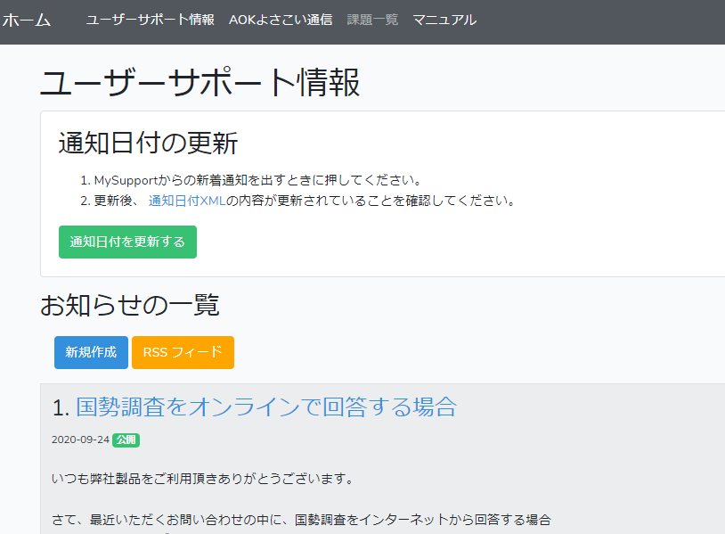
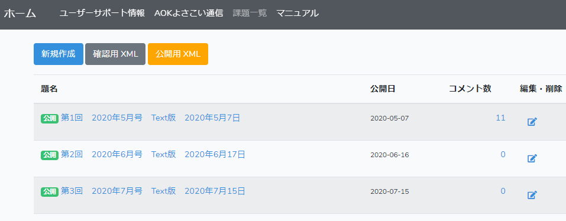
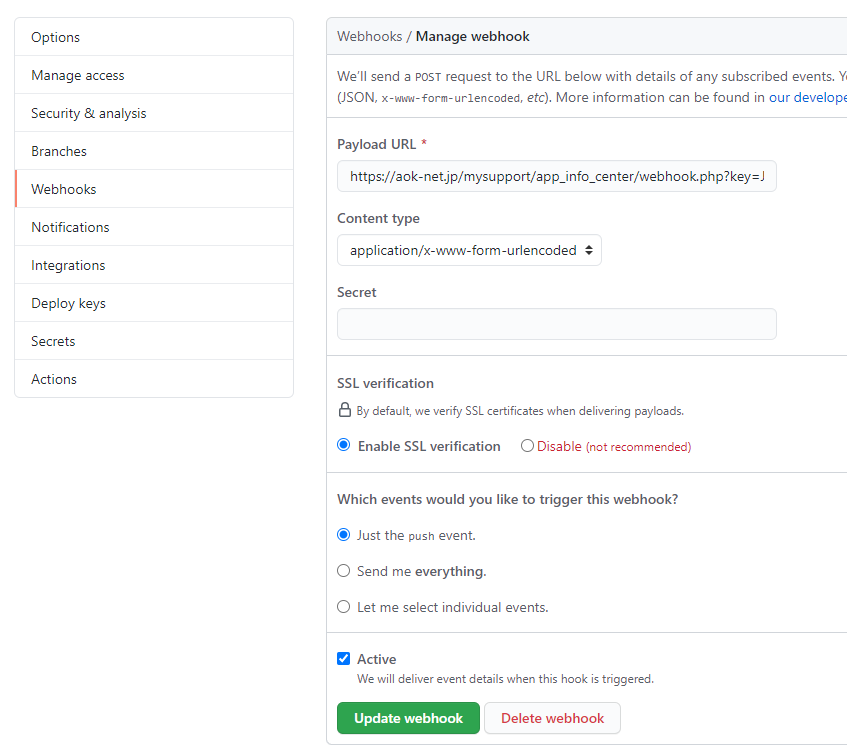

# MySupport用

## 機能

### ユーザーサポート情報UI

- https://aok-net.jp/mysupport/app_info_center/public/user_supports

> 


### よさこい通信UI

- https://aok-net.jp/mysupport/app_info_center/public/channels

> 


## 開発

### 必要な環境
- PHP >= 7.2.0
- パッケージ管理ツール[Composer](https://getcomposer.org/)
- [http://laravel.jp/](Laravel)6.0以上
- MySQL

## ダウンロードURL
- MySQLクライアント
  - https://dev.mysql.com/downloads/windows/installer/8.0.html

- composer
  - https://getcomposer.org/download/

## ローカルデバッグ
### 事前準備
1. MySQLのサービスが起動している状態であること
2. DBが作成されていること
  - `MySQL Command Line Tools`にログインして、`create database app_info_center;`を実行するとDBがつくられます。
3. `.env`を作成する
  - `.env.example`をリネームします
  - `DB_DATABASE`,`DB_USERNAME`, `DB_PASSWORD`をローカルの環境に設定します

### 実行コマンド
1. `git clone git@github.com:aok-net/app_info_center.git`
2. `composer install`
3. `php artisan migrate`（初回のみ。テーブルを作成します）
4. `php artisan db:seed`（初回のみ。）
5. `php artisan serve`

## デプロイ（サーバー側のファイルを更新する方法）

- `master`ブランチに`push`すると、サーバー側も最新に更新されます。

- SettingsでWebhookを設定しています。
> 

## さくらのダッシュボードへログインしてDB確認
- https://secure.sakura.ad.jp/rs/cp/
- データベースをひらく
- id: `app_info_center`
- pw: `jWPdHYmmJMyUV98`


- `php.ini`で有効にしておく拡張機能

```diff
- ;extension=pdo_mysql
+ extension=pdo_mysql
- ;extension=fileinfo
+ extension=fileinfo
```

## MySupportで動作試験する

### 運用環境での動作確認

- `MySupoprtで確認.bat`を実行してください。

### ローカル環境での動作確認
- `php artisan serve`
- ngrokで`8000`ポートをlistenします
  - `ngrok.exe http 8000`
  - [ngrokについて](https://dashboard.ngrok.com/get-started/setup)
- `MySupoprtで確認（localhost）.bat`を実行してください。


### MySupportが読み込むマスターXML

```xml
<?xml version="1.0" encoding="utf-8" ?>
<appinformation>
  <ksinfo>
    <title>MyNews Neo</title>
    <link>http://aok-net.jp/mysupport/appinformation/mynewsneo-news-index.xml</link>
    <date>Feb 10 2019 15:00:00 +0900</date>
  </ksinfo>
  <ksinfo>
    <title>MyDic Neo</title>
    <link>http://aok-net.jp/mysupport/appinformation/mydicneo-news-index.xml</link>
    <date>Nov 5 2019 15:00:00 +0900</date>
  </ksinfo>
  <ksinfo>
    <title>KTOS</title>
    <link>http://aok-net.jp/mysupport/appinformation/ktos-news-index.xml</link>
    <date>Sep 1 2019 15:00:00 +0900</date>
  </ksinfo>
  <ksinfo>
    <title>NetReader Neo</title>
    <link>http://aok-net.jp/mysupport/appinformation/netreaderneo-news-index.xml</link>
    <date>Feb 28 2020 12:00:00 +0900</date>
  </ksinfo>
</appinformation>
```

### link先のXML

```xml
<?xml version="1.0" encoding="utf-8"?>
<list-index><title>ユーザーサポート情報</title>
<linkbase>http://aok-net.jp/mysupport/service/info/</linkbase>
<item>
  <title></title>
  <category>お知らせ/Netreader Neoお知らせ</category>
  <type>description</type>
  <description><![CDATA[<h1>臨時休業のお知らせ</h1><hr><p>ユーザの皆様へ<br />]]></description>
</item>
</list-index>
```
